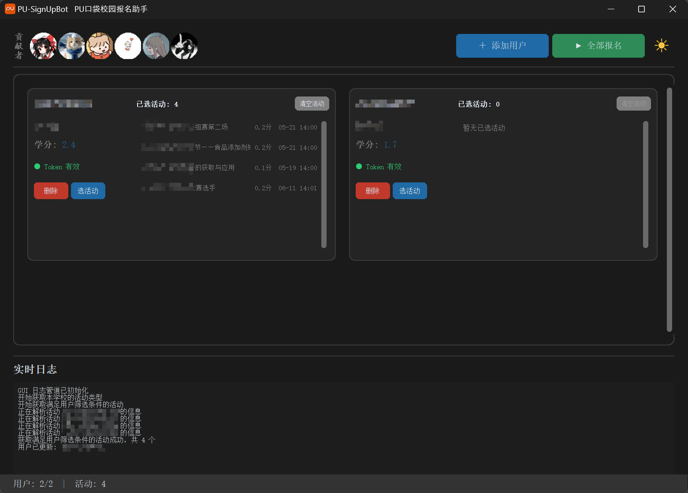

# PU-SignUpBot-GUI

PU 口袋校园活动自动报名助手 —— 带图形界面的桌面应用，双击即用。



## 缘起

本项目受 [_RedForest_](https://github.com/RedForestLonvor) 开发的 [PU-SignUpBot](https://github.com/RedForestLonvor/PU-SignUpBot) 启发。原项目功能完善，但为命令行（CLI）版本，非计算机专业的同学操作门槛较高——需要手动敲命令、编辑 JSON 配置文件，稍有不慎就容易出错。

本次重构将其改造为带图形界面（GUI）的桌面应用，使用 [CustomTkinter](https://github.com/TomSchimansky/CustomTkinter) 构建，目标是让不熟悉命令行的同学也能轻松使用：**双击打开、点选活动、一键报名**。

## 功能特性

- **图形界面**：告别命令行，全可视化操作
- **用户卡片管理**：最多 2 个账号，卡片式展示，信息一目了然
- **学分显示**：自动从 PU 平台拉取当前学分，实时展示
- **活动筛选与选择**：按年级、分类、院系勾选筛选，活动列表清晰展示名称、分数、开始时间
- **一键报名**：三阶段多线程抢报策略（5→15→45 线程），与服务器对时精准卡点
- **报名监控**：进度条 + 每活动状态表格 + 彩色实时日志
- **操作中止**：报名过程中可随时停止
- **亮/暗主题**：一键切换，暖灰米色柔和护眼
- **密码加密存储**：AES-128-CBC 加密，密钥基于本机指纹派生

## 快速开始（EXE 用户）

### 1. 下载

从 [Releases](https://github.com/Ranch007/PU-SignUpBot-GUI/releases) 下载最新版 `PU-SignUpBot-GUI-v0.x.0.zip`。

### 2. 解压运行

解压后双击 `PU-SignUpBot-GUI.exe` 即可运行。

> 首次运行时 Windows SmartScreen 可能提示"此应用可能危害您的设备"，点击"更多信息" → "仍要运行"即可。这是因为 EXE 未做代码签名，属正常现象。

## 源码运行

### 1. 环境要求

- Python 3.11+
- Git（可选，也可以直接下载 ZIP）

### 2. 下载项目

```bash
git clone https://github.com/Ranch007/PU-SignUpBot-GUI.git
cd PU-SignUpBot-GUI
```

或点击 GitHub 页面 **Code → Download ZIP**，解压到本地。

### 3. 安装依赖

在项目文件夹地址栏输入 `cmd` 回车，然后：

```bash
python -m venv .venv
.venv\Scripts\activate
pip install -r requirements.txt
```

> 也可以使用 [uv](https://docs.astral.sh/uv/)：`uv sync` 一条命令搞定。

### 4. 启动

```bash
python main.py
```

## 使用教程

### 第一步：添加用户

点击右上角 **"＋ 添加用户"**，三步向导：

1. **输入凭证** — 填写学号和 PU 密码
2. **选择学校** — 输入学校关键词（如"山东科技大学"），点击搜索，自动匹配学校 ID
3. **补充信息** — 填写院系**全称**（如"经济管理学院"），点击"验证并保存"自动校验登录

> 最多添加 2 个用户。如需更换，请先删除旧用户。

### 第二步：选择活动

点击用户卡片上的 **"选活动"** 按钮：

1. 左侧勾选筛选条件：
   - **参与年级** — 如 2023、2024
   - **活动分类** — 如 学术讲座、文体活动
   - **归属院系** — 如 法学院、计算机学院
2. 点击 **"获取活动"** 拉取符合条件的活动列表
3. 右侧勾选想要报名的活动，点击 **"保存选择"**

> **筛选规则**：同级维度内为"或"（勾选法学院 + 计算机学院 → 两个学院的活动都显示），跨维度为"且"（年级=2023 AND 分类=学术讲座 AND 院系=法学院）。

### 第三步：一键报名

点击右上角 **"▶ 全部报名"**，程序自动完成：

1. 与服务器时间同步
2. 持续监控活动开始时间（若主办方临时修改，自动跟进）
3. 到达报名时刻精确卡点，三阶段多线程并发抢报：
   - **第一轮**：5 线程快速尝试
   - **第二轮**：15 线程密集抢报
   - **第三轮**：45 线程持续保底
4. 实时日志和进度条反馈每场活动的报名结果

> 报名期间请保持程序运行、电脑不要休眠或关机。

### 其他操作

| 操作 | 方式 |
|------|------|
| 查看学分 | 用户卡片自动显示，实时从 PU 拉取 |
| 清空已选活动 | 点击卡片右上角 **"清空活动"** |
| 中止报名 | 报名监控页点击 **"⏹ 中止"** |
| 切换主题 | 点击右上角 ☀/🌙 按钮 |

## 常见问题

**Q: 提示"登录失败，请检查用户名和密码"？**

检查学号和密码是否正确，确认能在 [PU 口袋校园网页版](https://class.pocketuni.net/) 正常登录。确保学校搜索步骤选择了正确的学校。

**Q: 获取活动列表为空？**

可能是筛选条件太严格，试试放宽条件或先不勾选任何筛选，直接点"获取活动"。

**Q: 报名失败？**

可能原因：活动名额被抢完、不满足院系限制、网络波动。查看日志区的红色错误信息了解具体原因。

**Q: 能不能同时报多个活动？**

可以。每个用户卡片可勾选多个活动，程序按顺序依次抢报。

**Q: Token 显示"无效"怎么办？**

Token 有时效性，过期后删除该用户卡片重新添加即可。

**Q: 报名时能关掉程序吗？**

不能。报名期间请保持程序运行。如需中止，点击报名监控页的"⏹ 中止"按钮。

**Q: 能否添加超过 2 个用户？**

当前版本上限为 2 个。如需更多，可修改源码中 `user_data_manager.py` 和 `dashboard_page.py` 的 `>= 2` 限制。

## 界面布局

```
┌─ 贡献者头像 ──────────── [＋添加用户] [▶全部报名] [☀] ─┐
├─ ─ ─ ─ ─ ─ ─ ─ ─ ─ ─ ─ ─ ─ ─ ─ ─ ─ ─ ─ ─ ─ ─ ─ ─ ─ ┤
│                                                         │
│  ┌──────────────┬─────────────────────────┐              │
│  │ 用户名(加粗) │ 已选活动: N    [清空活动]│              │
│  │ 学院          │  活动A    2分  05-20 14:00│           │
│  │ 学分: 2.4    │  活动B    1分  05-22 09:00│           │
│  │ ● Token 有效 │                         │              │
│  │ [删除][选活动]│                         │              │
│  └──────────────┴─────────────────────────┘              │
│                                                         │
├─ ─ ─ ─ ─ ─ ─ ─ ─ ─ ─ ─ ─ ─ ─ ─ ─ ─ ─ ─ ─ ─ ─ ─ ─ ─ ┤
│ 实时日志                                                 │
├─────────────────────────────────────────────────────────┤
│ 用户: 2/2  |  活动: 5                                   │
└─────────────────────────────────────────────────────────┘
```

## 项目结构

```
├── main.py                   # 入口
├── core/                     # 业务逻辑（纯后端，禁止引用 GUI）
│   ├── activity_bot.py       # 报名机器人（对时、监控、三阶段多线程）
│   ├── single.py             # 单账号串行调度
│   ├── tools.py              # API 工具（登录、学校搜索、活动列表、学分）
│   ├── pu_sign.py            # X-Sign 签名（AES-128-CBC）
│   ├── crypto_utils.py       # 密码加解密（本机指纹派生密钥）
│   ├── user_data_manager.py  # 用户数据 CRUD + 监控持久化
│   ├── headers.py            # HTTP 请求头
│   └── PUExceptions.py       # 自定义异常
├── ui/                       # GUI（CustomTkinter）
│   ├── app.py                # 主窗口 + 日志管道
│   ├── styles.py             # 主题常量（颜色、字体、间距）
│   ├── pages/
│   │   ├── dashboard_page.py          # 仪表盘主页
│   │   ├── add_user_inline.py         # 添加用户（三步向导）
│   │   ├── activity_select_inline.py  # 活动筛选与选择
│   │   └── signup_inline.py           # 报名进度监控
│   └── widgets/
│       ├── user_card.py      # 用户信息卡片（左右双栏）
│       └── log_widget.py     # 实时彩色日志
└── ui/pages/contributors/    # 贡献者头像
```

## 安全

密码使用 AES-128-CBC 加密后存储在本地 `user_data.json`，加密密钥由本机主机名和用户名派生。更换电脑或重装系统后需重新添加用户。请勿在公共设备上使用。

## 致谢

- [RedForestLonvor / PU-SignUpBot](https://github.com/RedForestLonvor/PU-SignUpBot) — 原始 Idea 与核心逻辑
- 所有为本项目贡献代码和反馈的同学

---

**祝我们的大学生活不再受 PU 困扰！**
