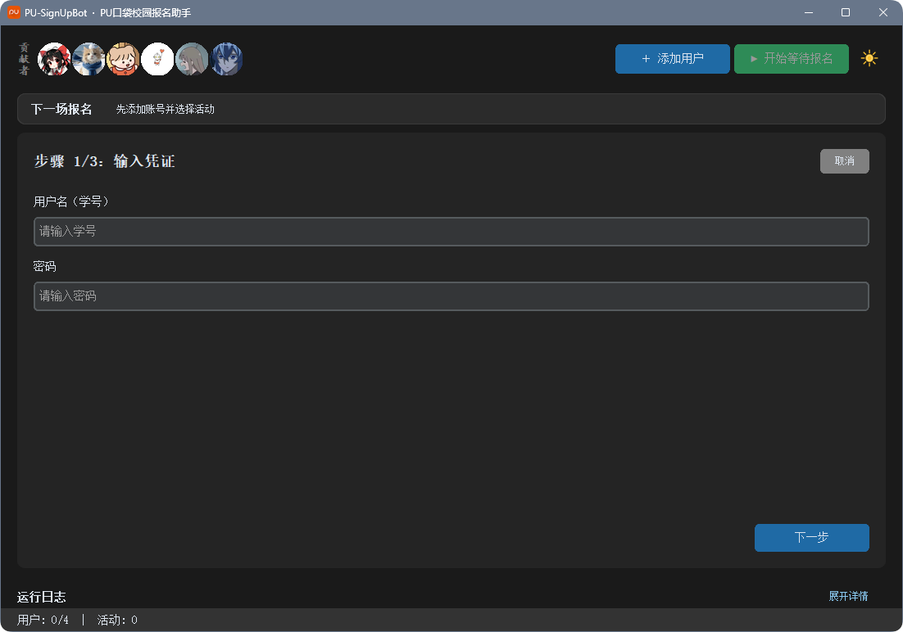
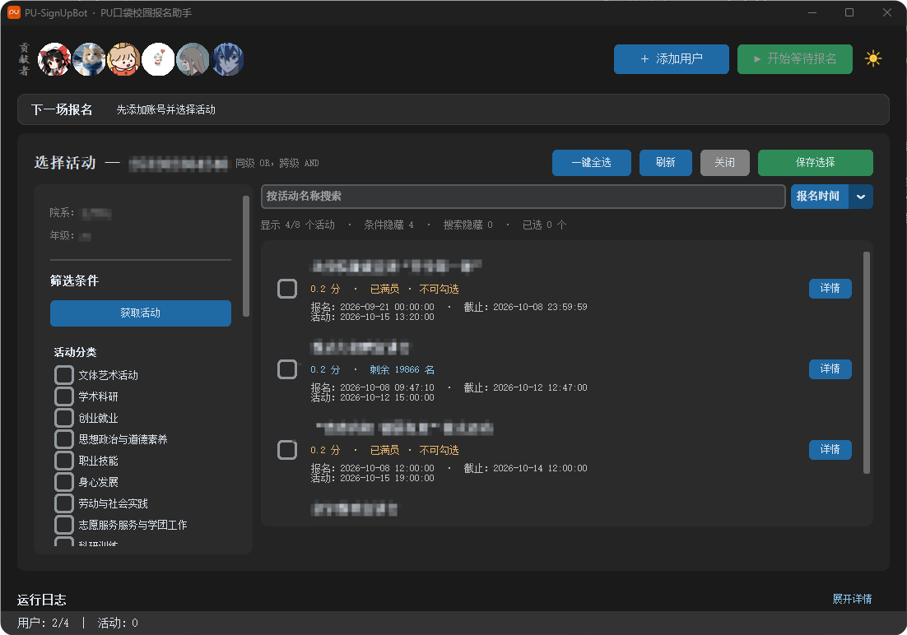
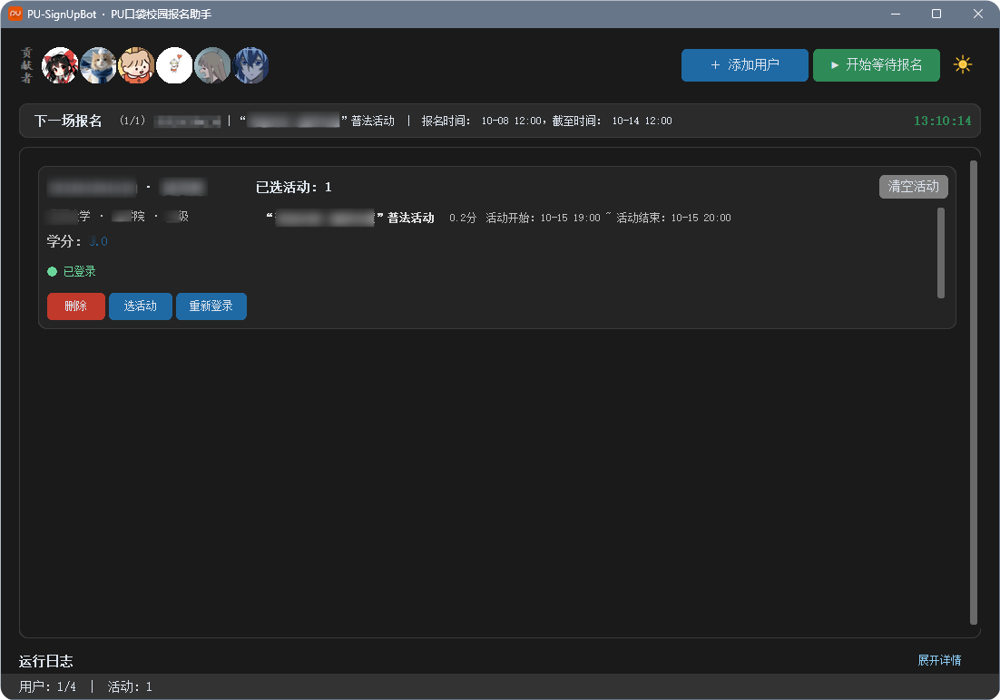

# PU-SignUpBot-GUI

PU 校园活动自动报名助手 —— 带图形界面的桌面应用，双击即用。

当前版本：**v1.1**。

## 缘起

本项目受 [_RedForest_](https://github.com/RedForestLonvor) 开发的 [PU-SignUpBot](https://github.com/RedForestLonvor/PU-SignUpBot) 启发。原项目功能完善，但为命令行（CLI）版本，非计算机专业的同学操作门槛较高——需要手动敲命令、编辑 JSON 配置文件，稍有不慎就容易出错。

本次重构将其改造为带图形界面（GUI）的桌面应用，使用 [CustomTkinter](https://github.com/TomSchimansky/CustomTkinter) 构建，目标是让不熟悉命令行的同学也能轻松使用：**双击打开、点选活动、一键报名**。

## 功能特性

- **图形界面**：告别命令行，全可视化操作
- **用户卡片管理**：最多 4 个账号，按学校和学号区分；不同学校可保存同名学号
- **重新登录**：更新本地保存的当前 PU 密码和登录状态，保留已选活动；PU 返回的院系、年级可自动填写并手动补充
- **学分显示**：自动从 PU 平台拉取当前学分，实时展示
- **活动筛选与选择**：按年级、分类、院系筛选，按名称搜索和排序，查看报名时间、活动时间、地点、学分和名额
- **报名计划**：首页显示下一场报名及倒计时；切换搜索和筛选时保留已勾选活动
- **一键报名**：三阶段报名尝试（每轮最多提交 5→15→45 个任务），所有网络请求共享 8 个并发名额；确定的业务失败停止自动尝试，网络故障和限流有限重试；每次报名请求发送前检查截止时间
- **报名监控**：进度条 + 每活动状态表格 + 彩色实时日志
- **操作中止**：报名过程中可随时停止
- **亮/暗主题**：一键切换，暖灰米色柔和护眼
- **本地凭据保护**：Windows 使用当前用户的 DPAPI 保护密码和登录 Token

## 快速开始（EXE 用户）

### 1. 下载

从 [Releases](https://github.com/Ranch007/PU-SignUpBot-GUI/releases) 下载最新发布的 ZIP。

### 2. 解压运行

解压后双击 `PU-SignUpBot-GUI.exe` 即可运行。

> 当前 EXE 未做代码签名，Windows 可能显示 SmartScreen 提示。请先确认文件来自本仓库的 Releases，确认来源可信后再决定是否运行。

## 源码运行

### 1. 环境要求

- Python 3.11+
- Git（可选，也可以直接下载 ZIP）

### 2. 下载项目

```bash
git clone https://github.com/Ranch007/PU-SignUpBot-GUI.git
cd PU-SignUpBot-GUI
```

或点击 GitHub 页面 **Code → Download ZIP**，解压到本地。

### 3. 安装依赖

在项目文件夹地址栏输入 `cmd` 回车，然后：

```bash
python -m venv .venv
.venv\Scripts\activate
pip install -r requirements.txt
```

> 也可以使用 [uv](https://docs.astral.sh/uv/)：`uv sync --locked` 使用仓库中的 `uv.lock` 安装已锁定的版本。

### 4. 启动

```bash
python main.py
```

构建 Windows EXE 时，在已安装运行依赖的环境中安装 PyInstaller，再运行 `pyinstaller PU-SignUpBot-GUI.spec`。发布前应启动生成的 EXE，并对最终目录或 ZIP 运行 `python scripts/check_release.py <发布目录或ZIP路径>`。新版运行数据和日志写入 `%LOCALAPPDATA%\PU-SignUpBot-GUI`；旧版 EXE 旁的账号、设置和任务文件会在首次启动时复制到新目录，旧副本保留供核对。发布包不得包含账号文件、Token、日志或任务记录。

## 使用教程

### 第一步：添加用户

点击右上角 **"＋ 添加用户"**，三步向导：

1. **输入凭证** — 填写学号和 PU 密码
2. **选择学校** — 输入学校关键词（如"山东科技大学"），点击搜索，从候选列表确认学校
3. **补充信息** — 自动验证登录并读取 PU 返回的资料；核对院系**全称**和年级，未返回的资料可手动填写，点击"保存账号"

> 最多添加 4 个用户。同学校的重复学号不能再次添加；不同学校的同名学号分别管理。

### 第二步：选择活动

点击用户卡片上的 **"选活动"** 按钮：

1. 左侧勾选筛选条件：
   - **参与年级** — 只自动勾选当前账号的年级，如 25 级账号默认勾选 25 级；各账号独立筛选，使用各自学校的选项，可手动调整。资料缺失时提示补充或手动选择
   - **活动分类** — 如 学术讲座、文体活动
   - **归属院系** — 如 计算机学院、人工智能学院
2. 点击 **"获取活动"** 拉取符合条件的活动列表
3. 右侧可按名称搜索、按报名时间／活动时间／学分排序，点击 **"详情"** 查看地点、报名截止时间与已知参与条件的匹配结果。明确院系或年级不匹配的未选活动会隐藏；已选的不匹配活动保留供取消，取消后隐藏。不明条件仍需在 PU 核对
   - 符合条件的满员活动仍显示，标注“已满员”且不能新增勾选；之前已选的可取消。名额未知时显示待确认
   - **刷新** — 按当前筛选条件重新获取候选活动，保留搜索词及未保存的选择
   - **一键全选** — 追加勾选当前搜索结果中未满员、已知资格匹配的活动；明确限制待核对的项目可核实后手动选择，全选后仍需点击“保存选择”
4. 勾选想要报名的活动，点击 **"保存选择"**；活动时间重叠时会提醒，再点一次可保留

> **筛选规则**：同级维度内为"或"（勾选法学院 + 计算机学院 → 两个学院的活动都显示），跨维度为"且"（年级=2023 AND 分类=学术讲座 AND 院系=法学院）。

### 第三步：一键报名

首页会显示下一场报名时间与倒计时。点击右上角 **"▶ 开始等待报名"** 后启动已选活动并打开报名计划。每个活动会独立等待报名时间，程序自动完成：

1. 与服务器时间同步
2. 持续监控活动开始时间（若主办方临时修改，自动跟进）
3. 到达报名时间后，分三阶段尝试；对时精度和网络延迟会影响实际请求时间：
   - **第一轮**：提交 5 个快速尝试任务
   - **第二轮**：分批提交最多 15 个任务
   - **第三轮**：分批提交最多 45 个任务（对时、登录、查询和报名共享 8 个同时请求的上限）
4. 报名计划直接显示每场活动的状态和结果；需要排错时可展开底部运行日志

> 可以关闭报名计划面板，后台任务会继续；退出程序时如果还有任务，会先提示确认。报名期间请保持电脑运行、不要休眠。

报名计划中可按账号筛选，查看每项活动名称、报名时间和当前状态，也可单项开始、取消或移除。失败和取消的项目可单项重试；登录过期时可直接点击“重新登录”，其他失败可点击“详情”核对条件；已成功的项目不会因再次点击批量开始而重复报名。运行中意外退出的任务在重启后显示“待恢复”，须由你点击“检查并恢复”；程序会先检查登录、活动状态、报名时间和名额。已完成或取消的任务不会自动重启，结果可在“历史记录”中查看。

### 其他操作

| 操作                         | 方式                                                   |
| ---------------------------- | ------------------------------------------------------ |
| 查看学分                     | 用户卡片自动显示，实时从 PU 拉取                       |
| 清空已选活动                 | 点击卡片右上角"**清空活动**"                           |
| 更新本地保存的密码或重新登录 | 点击账号卡片上的"**重新登录**"，验证成功后保留已选活动 |
| 中止报名                     | 报名计划中点击单项"**取消**" 或"**⏹ 全部取消**"       |
| 切换主题                     | 点击右上角 ☀/🌙 按钮                                  |

## 常见问题

**Q: 提示"登录失败，请检查用户名和密码"？**

查看界面上的具体失败原因，再检查学号、密码和学校；可到 [PU 校园活动网页版](https://class.pocketuni.net/) 验证账号。

**Q: 获取活动列表为空？**

可能是筛选条件太严格，试试放宽条件或先不勾选任何筛选，直接点"获取活动"。

**Q: 报名失败？**

可能原因：活动名额已满、不满足参与条件或网络波动。报名计划保留具体业务错误和错误码；确定失败停止自动请求，临时网络故障或限流最多容许三次失败后停止。先按提示重新登录或核对详情，再决定是否手动重试。

**Q: 能不能同时报多个活动？**

可以。每个用户卡片可勾选多个活动，各项任务独立等待报名时间，报名请求有统一并发上限。

**Q: Token 显示"无效"怎么办？**

登录信息有时效性，卡片会显示“登录待验证”“已登录”或“登录已过期”。登录过期后点击原账号卡片上的“重新登录”，已选活动会保留。

**Q: 报名时能关掉程序吗？**

程序关闭时会提示仍在运行的任务。若确定退出，等待中的任务会停止；下次启动后需要在报名计划中逐项检查并恢复。

**Q: 能否添加超过 4 个用户？**

当前版本最多保存 4 个账号。

## 界面布局







## 项目结构

```
├── main.py                   # 入口
├── core/                     # 业务逻辑（纯后端，禁止引用 GUI）
│   ├── activity_bot.py       # 报名机器人（对时、监控、三阶段多线程）
│   ├── signup_tasks.py       # 独立任务调度、取消和恢复状态
│   ├── task_store.py         # 任务状态持久化
│   ├── restore.py            # 恢复前只读校验
│   ├── atomic_json.py        # 原子写入与备份
│   ├── pu_api.py             # 统一接口、错误分类、重试和请求限制
│   ├── accounts.py           # 学校/学号身份与过时凭据校验
│   ├── activity_filters.py   # 当前账号年级筛选默认值
│   ├── config.py             # 账号数量、并发与重试限制
│   ├── participation.py      # 明确参与条件的匹配与未知提示
│   ├── tools.py              # API 工具（登录、学校搜索、活动列表、学分）
│   ├── pu_sign.py            # X-Sign 签名（AES-128-CBC）
│   ├── crypto_utils.py       # 本地凭据保护与旧格式兼容
│   ├── user_data_manager.py  # 用户数据与旧版监控记录
│   ├── headers.py            # HTTP 请求头
├── ui/                       # GUI（CustomTkinter）
│   ├── app.py                # 主窗口 + 日志管道
│   ├── styles.py             # 主题常量（颜色、字体、间距）
│   ├── pages/
│   │   ├── dashboard_page.py          # 仪表盘主页
│   │   ├── add_user_inline.py         # 添加用户（三步向导）
│   │   ├── activity_select_inline.py  # 活动筛选与选择
│   │   ├── relogin_inline.py          # 原账号重新登录
│   │   └── signup_inline.py           # 报名进度监控
│   └── widgets/
│       ├── user_card.py      # 用户信息卡片（每个账号占一整行）
│       └── log_widget.py     # 实时彩色日志
└── ui/pages/contributors/    # 贡献者头像
```

## 安全

Windows 版会加密保存密码和登录信息。升级时，程序会复制旧账号数据；确认新版运行正常后，请自行清理旧副本，不要分享账号文件。换电脑或重装系统后，可能需要重新登录。非 Windows 源码版的本地保护较弱，请勿在公共电脑上保存账号。

PU 的接口和规则可能变化，请遵守学校及平台规定；程序无法保证报名成功。

## 致谢

感谢 [RedForestLonvor](https://github.com/RedForestLonvor) 开发原项目 [PU-SignUpBot](https://github.com/RedForestLonvor/PU-SignUpBot)，为本项目提供最初的思路与核心逻辑；也感谢以下所有贡献者。点击头像或名字可访问 GitHub 主页。

| 头像                                              | 贡献者                                               | 致谢       |
| ------------------------------------------------- | ---------------------------------------------------- | ---------- |
| <a href="https://github.com/RedForestLonvor"></a> | [RedForestLonvor](https://github.com/RedForestLonvor) | 原创作者   |
| <a href="https://github.com/yiqjffeng"></a>       | [yiqjffeng](https://github.com/yiqjffeng)             | 项目贡献者 |
| <a href="https://github.com/DGYJ-fufu"></a>       | [DGYJ-fufu](https://github.com/DGYJ-fufu)             | 项目贡献者 |
| <a href="https://github.com/later-we"></a>        | [later-we](https://github.com/later-we)               | 项目贡献者 |
| <a href="https://github.com/Mhenwa"></a>          | [Mhenwa](https://github.com/Mhenwa)                   | 项目贡献者 |
| <a href="https://github.com/Ranch007"></a>        | [Ranch007](https://github.com/Ranch007)               | 项目贡献者 |

## 许可证

本项目按 [GNU GPL v3 或更高版本](LICENSE) 发布（SPDX：`GPL-3.0-or-later`）。分发修改后的源码或 EXE 时，请保留版权和许可证声明，并按 GPL 提供相应源码。

---

**祝我们的大学生活不再受 PU 困扰！**
